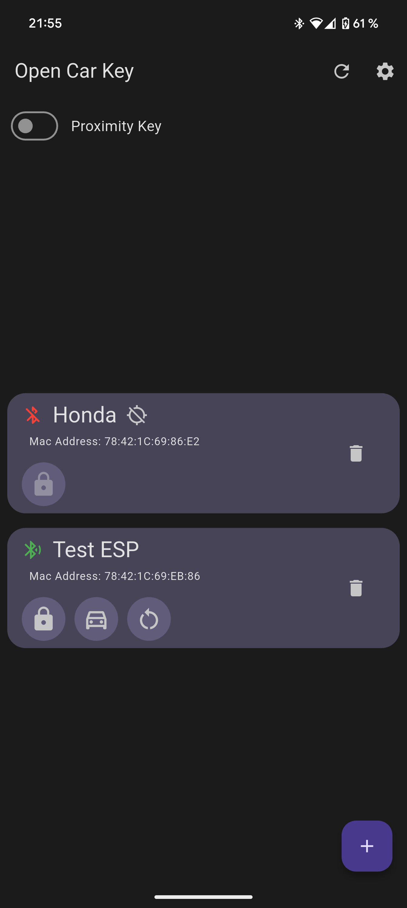
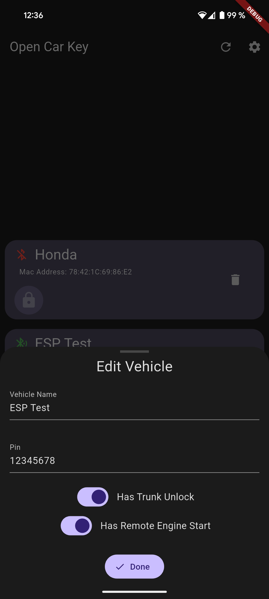

# OpenCarKey

OpenCarKey is an open source project to make your own DIY remote car key or keyless entry.

>[!CAUTION]
>**Disclaimer:** This project is currently in the development phase, so it my still contain some bugs.

If you plan to use the app you can help by filling out this quick [survey](https://forms.gle/NZScbn8mKhP7yUqp9) about what features should be added to it. 

## Features:
### Current
- App to lock, unlock, open the trunk or remote start the engine from your phone
- Proximity key (with customizable trigger range) to auto lock and unlock your car if you are near it
- Support for multiple vehicles
- ESP32 counterpart to the app

  
  
  

### Planned
- Hardware keyfob using an ESP32 as alternative for the phone (one keyfob for all your cars using OpenCarKey)
- Get at least some support for IOS (as far as possible with is limitations)
- Auto save parking location if car gets out of range
- Home screen widget and Android quick settings tiles

## Getting Started
### Mobile App
Clone the repo and open the `MobileApp` directory in Android Studio or your preferred code editor that supports Flutter.

### ESP32 Lock Controller
Clone the repo and open `Firmware/LockController/` with [PlatformIO](https://platformio.org/platformio-ide).
Now you can add custom code for locking, unlocking etc. more info [here](Docs/LockController.md#custom-code-for-locking-unlocking-etc).
Then you can open the `platformio.ini` file and change `LOCK_PIN` to any password you want.
Now you can connect you ESP32 and upload the code and then connect it with the app.

[Lock Controller Docs](Docs/LockController.md)