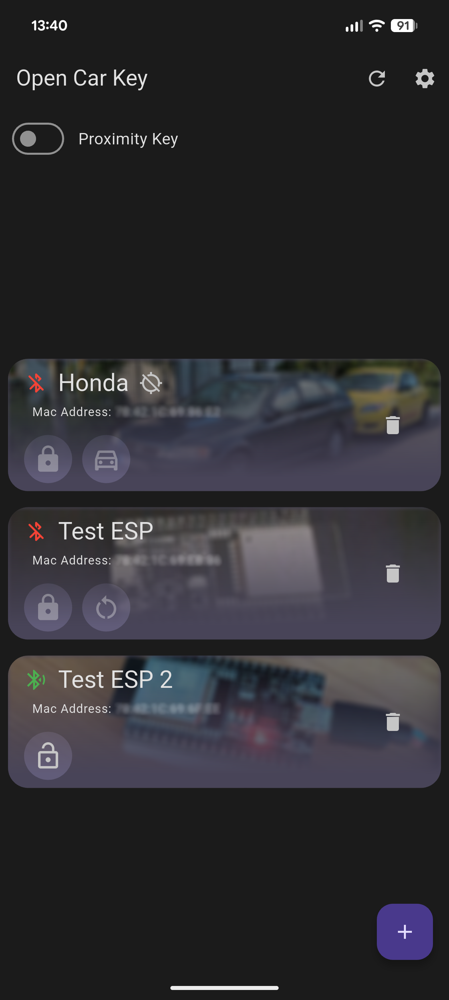
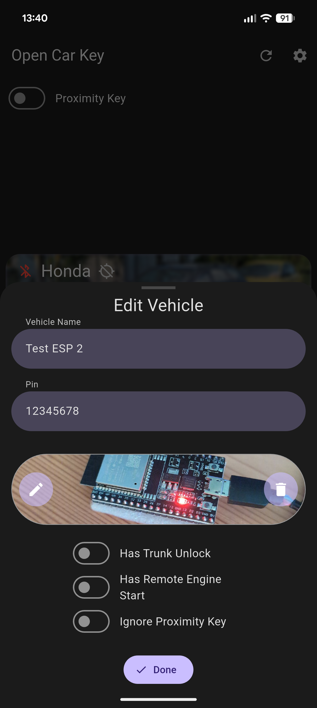
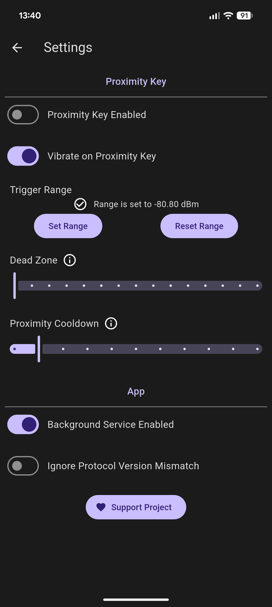
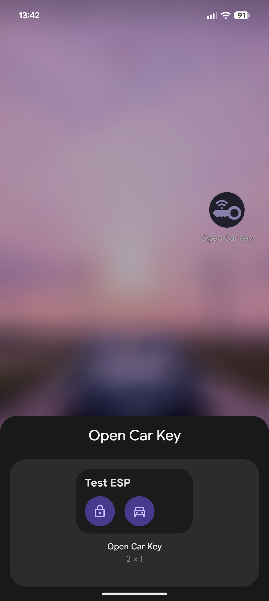

# OpenCarKey

OpenCarKey is an open source project to make your own DIY remote car key or keyless entry.

>[!WARNING]
>For better security and to prevent replay attacks commands are now sent with an HMAC and rolling code, there might still be issues with for example the counter getting out of sync.
>If this happens to you please create an issues with exactly what you did. To rest the counter hold the `BOOT` button on the EPS32 for 5 sec and tap the rest button when the app prompts you.

>[!CAUTION]
>**Disclaimer:** This project is currently in the development phase, so it my still contain some bugs and is not fully done yet.

If you plan to use the app you can help by filling out this quick [survey](https://forms.gle/NZScbn8mKhP7yUqp9) about what features should be added to it. 

If you need help or have more feature ideas you can join the [Discord](https://discord.gg/dYf8zrVUHt)!

## Features:
### Current
- App to lock, unlock, open the trunk or remote start the engine from your phone
- Proximity key (with customizable trigger range) to auto lock and unlock your car if you are near it
- Support for multiple vehicles
- Home screen widget
- ESP32 counterpart to the app
- Authenticated commands with an HMAC that includes a per-device increasing counter (rolling codes) to prevent replay attacks.

  
  
  
  

### Planned
- Hardware keyfob using an ESP32 as alternative for the phone (one keyfob for all your cars using OpenCarKey)
- Get at least some support for IOS (as far as possible with is limitations)
- Auto save parking location if car gets out of range

## Getting Started
### Mobile App
Clone the repo and open the `MobileApp` directory in Android Studio or your preferred code editor that supports Flutter.

### ESP32 Lock Controller
Clone the repo and open `Firmware/LockController/` with [PlatformIO](https://platformio.org/platformio-ide).
Now you can add custom code for locking, unlocking etc. more info [here](Docs/LockController.md#custom-code-for-locking-unlocking-etc).
Then you can open the `platformio.ini` file and change `LOCK_PIN` to any password you want.
Now you can connect you ESP32 and upload the code and then connect it with the app.

[Lock Controller Docs](Docs/LockController.md)